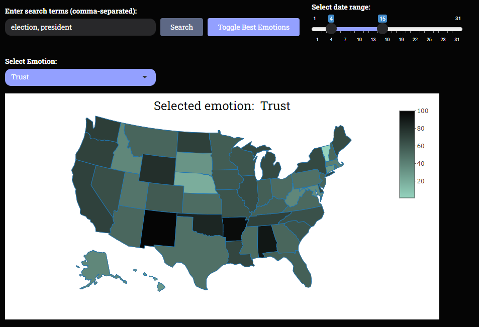
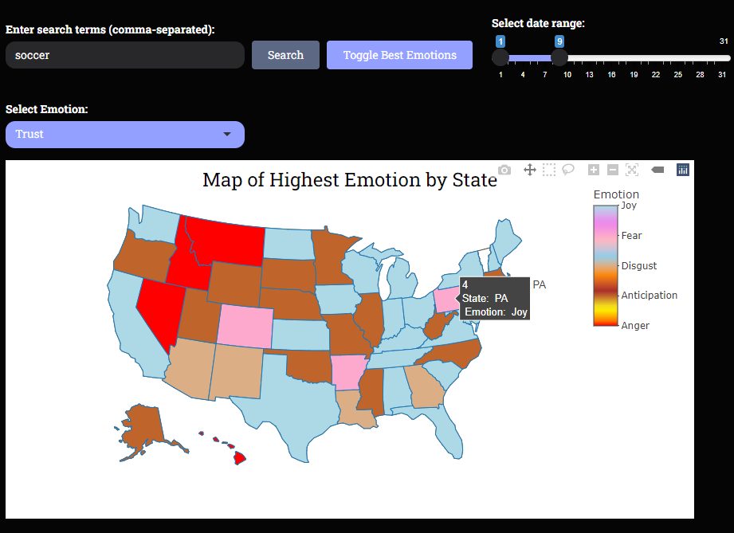
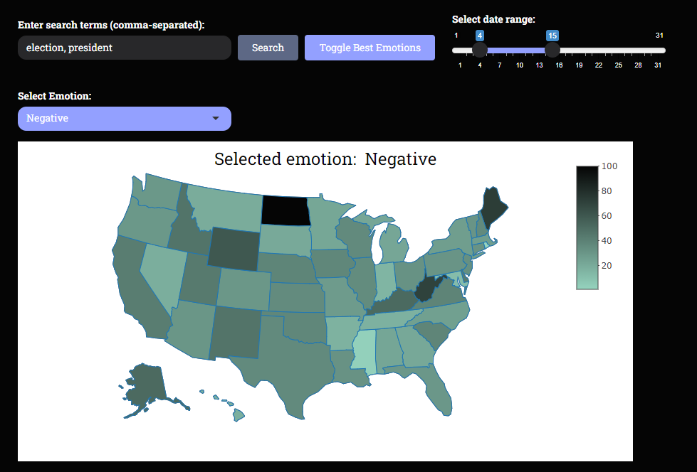

# Sentiment Analysis Web Application




An interactive platform for understanding contemporary sentiment and trends on pressing societal issues across the United States.

## Table of Contents

- [Introduction](#introduction)
- [Features](#features)
- [Technologies Used](#technologies-used)
- [Installation](#installation)
  - [Prerequisites](#prerequisites)
  - [Steps](#steps)
- [Usage](#usage)
- [Contributing](#contributing)
- [Contact](#contact)
- [Screenshots](#screenshots)

## Introduction

This platform leverages over 3 million tweets to map and analyze public sentiment across the United States. By harnessing Twitter's vast user base, it provides real-time insights into emotional responses surrounding key societal and political events.

## Features

- **Real-time Sentiment Analysis**: Analyze sentiments such as anger, joy, and trust from Twitter data.
- **Interactive Visualizations**: Emotion-specific sentiments displayed on a U.S. state-level choropleth map.
- **Keyword-Based Searches**: Allows users to input specific keywords for targeted sentiment analysis.
- **Advanced Text Processing**: Employs techniques to filter and clean tweet data for robust analysis.

## Technologies Used

- **Programming Language**: R
- **Web Framework**: Shiny
- **Data Visualization**: ggplot2, plotly
- **Text Processing**: tidytext, dplyr

## Installation

### Prerequisites

- **R** (version 4.0 or higher) (https://cran.r-project.org/bin/windows/base/) 
- **RStudio** (optional but recommended) (https://posit.co/downloads/)
- **Git** for cloning the repository

### Steps

1. **Clone the Repository**

   ```bash
   git clone https://github.com/Khanisic/Sentiment-Analysis-Web-Application.git
   
2. **Navigate to the Project Directory**

   ```bash
   cd Sentiment-Analysis-Web-Application
   
3. **Install Required R Packages**

   Open R or RStudio and run:

   ```r
   install.packages(c("shiny", "ggplot2", "plotly", "rtweet", "tidytext", "dplyr", "memoise"))

4. **Run the Application**

   In R or RStudio:

   ```r
   shiny::runApp()

## Usage

- **Home Page**: Displays a U.S. map with default sentiment analysis.
- **Search Functionality**: Input keywords to filter tweets and update the sentiment map.
- **Emotion Selection**: Choose specific emotions (anger, joy, trust, etc.) to visualize.
- **Interactive Map**: Hover over states to see detailed sentiment data.


## Contributing

Thank you for using the Sentiment Analysis Web Application! We hope you find it helpful for your research and analysis.

You are most welcome to make contributions to improve this project. If you have ideas for new features, bug fixes, or enhancements, feel free to fork the repository and submit a pull request. We appreciate your support and look forward to your contributions!

## Screenshots





## Contact

If you have any questions or would like to get in touch, feel free to contact us:

- **Abdul Moid Khan Mohammed**
  - Email: [amohammed48@mail.bradley.edu](mailto:skhan852000@gmail.com)
  - GitHub: [Khanisic](https://github.com/Khanisic)


